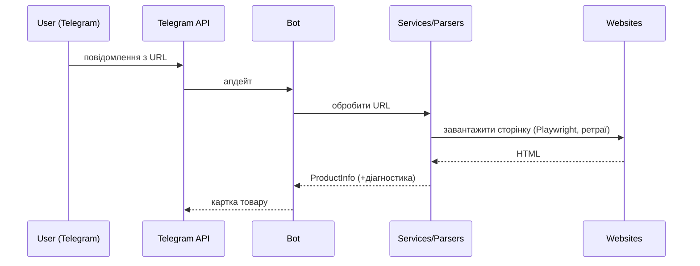

# 🚀 TELEBOTYLAUKRAINE

Телеграм-бот для просунутої роботи з **e-commerce**:
парсинг товарів, мульти-регіональна перевірка наявності, розрахунок цін, генерація контенту та інтеграція з OpenAI API.

⸻

## 📌 Основні можливості

✅ **Парсинг товарів та колекцій** — асинхронне отримання даних із сайтів (ціна, фото, вага, наявність).
✅ **Розрахунок цін** — нове математичне ядро у domain/pricing: доставка, комісії, націнка, округлення через UAH.
✅ **Перевірка наявності**  — паралельна перевірка кольорів та розмірів у регіонах (США, ЄС, UK).
✅ **Обробка таблиць розмірів** — OCR-розпізнавання та генерація таблиць у сантиметрах.
✅ **Інтеграція з OpenAI** — переклад, генерація хештегів, музичні рекомендації.
✅ **Playwright + Cloudflare Bypass**  — стабільний парсинг навіть із захистом Cloudflare.
✅ **Автоматизація YoungLA-замовлень** — .txt-файл зі SKU/Color/Size → товари автоматично
  додаються у кошик і відкривається Protected Checkout.

⸻

## 📂 Архітектура та структура проєкту

Проєкт побудований за принципами **Clean Architecture**:
логіка розділена на незалежні шари, що робить код гнучким, тестованим і простим у підтримці.

```bash
📦 TELEBOTYLAUKRAINE
├── 📂 docs                     # 🧾 Гайди, стайлгайд, recovery-плани
├── 📂 src
│   └── 📂 app
│       ├── 📂 assets           # 🗂️ Статичні ресурси
│       │   └── 📂 fonts        # 🔤 Fallback-шрифти для генерації таблиць/банерів
│       ├── 📂 bot              # 🤖 Telegram UI-шар
│       │   ├── 📂 commands     # 📜 /start, /help, меню, валютні сценарії
│       │   ├── 📂 handlers     # 🔗 Link/Product/SizeChart/Price хендлери
│       │   ├── 📂 services     # 🛠️ CallbackRegistry, CustomContext, фабрики
│       │   └── 📂 ui           # 🖼️ Messengers, форматери, клавіатури
│       ├── 📂 config           # ⚙️ DI та конфігурація
│       │   ├── 📂 setup        # 🧩 Container, registrar, constants
│       │   └── 📂 yamls        # 📑 base/features/local/providers + README
│       ├── 📂 domain           # 🧠 Чисте бізнес-ядро
│       │   ├── 📂 ai           # 🤖 Контракти AI/prompt сервісів
│       │   ├── 📂 availability # 🌍 Перевірка наявності
│       │   ├── 📂 content      # 🏷️ IHashtagGenerator та DTO
│       │   ├── 📂 currency     # 💱 Money, IMoneyConverter
│       │   ├── 📂 delivery     # 🚚 IDeliveryService та DeliveryQuote
│       │   ├── 📂 image_generation # 🖼️ Контракти шрифтів
│       │   ├── 📂 music        # 🎵 Контракти рекомендацій
│       │   ├── 📂 pricing      # 💰 FullPriceDetails, q2/percent, PricingService
│       │   ├── 📂 products     # 📦 DTO, entities, WeightResolver
│       │   ├── 📂 size_chart   # 📏 ISizeChartService та події прогресу
│       │   └── 📂 web          # 🌐 IWebClient контракт
│       ├── 📂 errors           # 🛡️ Error handler, стратегії, custom errors
│       ├── 📂 i18n             # 🌐 YAML-локалізації (uk/ru/en)
│       ├── 📂 infrastructure   # 🏗️ Інтеграції та адаптери
│       │   ├── 📂 adapters     # 🔌 HashtagAdapter, PriceMessageFacade
│       │   ├── 📂 ai           # 🤖 OpenAI клієнти, AI Task Service
│       │   ├── 📂 availability # ✅ Manager, handler, cache, formatter
│       │   ├── 📂 collection_processing # ⚙️ Збір посилань колекцій
│       │   ├── 📂 content      # 📝 AltText, HashtagGenerator, ProductContentService
│       │   ├── 📂 currency     # 💱 CurrencyManager, legacy converters
│       │   ├── 📂 data_storage # 🗄️ WeightDataService
│       │   ├── 📂 delivery     # 🚚 MeestDeliveryService
│       │   ├── 📂 image_generation # 🖼️ FontService
│       │   ├── 📂 music        # 🎵 Downloader, sender, рекомендації
│       │   ├── 📂 parsers      # 🔎 BaseParser, factories, collections, extractors
│       │   ├── 📂 services     # 🧠 ProductProcessingService + фасади
│       │   ├── 📂 size_chart   # 🧾 OCR, генератори таблиць, YoungLA finder
│       │   ├── 📂 url          # 🔗 YoungLAUrlStrategy
│       │   └── 📂 web          # 🌍 Playwright WebDriverService
│       ├── 📂 shared           # 🧰 Кеші, метрики, промпти, утиліти
│       │   ├── 📂 cache        # ♻️ HtmlLruCache
│       │   ├── 📂 metrics      # 📊 Prometheus counters/exporter
│       │   ├── 📂 prompts      # ✍️ uk/ocr промпти
│       │   └── 📂 utils        # 🧱 Logger, url parser, collections, errors
├── 📂 tests                   # 🧪 Pytest- та інтеграційні сценарії
├── 📂 music_cache             # 🎵 Локальний кеш аудіо/рекомендацій
├── 📂 logs                    # 📜 Runtime-логи бота/інтеграцій
├── 📂 htmlcov                 # 📈 Coverage-репорти (генеруються за потреби)
├── 📜 .env                    # 🔐 Секрети (OpenAI, Telegram tokens)
├── 📜 pyproject.toml          # 📦 Poetry-залежності
├── 📜 README.md               # 📘 Цей файл
└── 📜 project_recovery_guide.md # 🆘 План відновлення після збоїв
⸻

## 🧩 Шари архітектури

🔹 domain — чисте ядро системи: тільки моделі та бізнес-логіка, без зовнішніх залежностей.
🔹 infrastructure — робота із зовнішнім світом: парсери, API, OpenAI, WebDriver, кеш.
🔹 bot — UI шар: Telegram-команди, хендлери, форматери, повідомлення.
🔹 config — DI та налаштування: yaml-файли, сервіси, константи.
🔹 errors — централізований обробник помилок для стабільності бота.
🔹 shared — загальні утиліти та промпти.

⸻

## 🧠 Архітектурна діаграма (4 шари)

```mermaid
flowchart TD
    A[bot (UI)] --> B[infrastructure]
    B --> C[domain]
    A --> D[config]
    A --> E[errors]
    B --> E
    A --> F[shared]
    B --> F
    C --> F

    subgraph UI
      A
    end
    subgraph Infra
      B
    end
    subgraph Domain
      C
    end
    subgraph Config/DI
      D
    end
    subgraph Errors
      E
    end
    subgraph Shared
      F
    end
```

🔹 domain — чисті моделі/контракти, без зовнішніх залежностей.
🔹 infrastructure — інтеграції (OpenAI, парсери, Playwright, кеші, delivery).
🔹 bot (UI) — Telegram-оболонка (handlers, messengers, форматери).
🔹 config — DI/контейнер, YAML-конфіги, константи.
🔹 errors — централізований error-handling.
🔹 shared — утиліти, промпти, інтерфейси.

⸻

## 🌐 Контекст: зовнішні системи

```mermaid
flowchart LR
  U[Користувач у Telegram] -->|повідомлення| TG[Telegram Bot API]
  TG -->|webhook/polling| BOT[YoungLA Bot (процес)]
  BOT -->|HTTP| OPENAI[OpenAI API]
  BOT -->|/metrics (опційно)| PROM[Prometheus (скрейпер)]
```

*(Якщо метрики не ввімкнені — цей блок можна залишити як «опційно».)*

---

## 🔁 Послідовність: користувач кидає лінк




## 🧰 Dependency Injection (DI) та композиція
Головна точка збирання — app/config/setup/container.py. Контейнер:
створює сервіси у правильному порядку,
впроваджує залежності через конструктори,
надає єдину точку доступу до компонентів.

# app/config/setup/container.py (уривок)
class Container:
    def _setup_infrastructure(self) -> None:
        self.currency_manager = CurrencyManager(config_service=self.config)              # 💱 Курси валют
        self.delivery_service = MeestDeliveryService(config_service=self.config)        # 🚚 Тарифи доставки
        ...

    def _setup_domain_services(self) -> None:
        self.pricing_service = PricingService(                                         # 💰 Доменне ціноутворення
            delivery_service=self.delivery_service,
        )
        self.weight_resolver = WeightResolver(...)                                     # ⚖️ Інші доменні сервіси

    def _setup_high_level_services(self) -> None:
        self.price_calculator = PriceCalculationHandler(
            currency_manager=self.currency_manager,
            parser_factory=self.parser_factory,
            pricing_service=self.pricing_service,
            config_service=self.config,
            constants=self.constants,
            exception_handler=self.exception_handler_service,
            url_parser_service=self.url_parser_service,
        )
        self.content_service = ProductContentService(
            translator=self.translator_service,
            hashtag_generator=self.hashtag_generator,
            price_handler=self.price_calculator,
            alt_text_generator=self.alt_text_generator,
        )

Перед розрахунком ціни `PriceCalculationHandler` оновлює курси (`CurrencyManager.update_all_rates_if_needed()`), дістає `IMoneyConverter` і вже у фоновому потоці викликає `PricingService.calculate_full_price(...)`. Доменний сервіс звертається до `IDeliveryService.quote(...)`, обʼєднує локальні витрати з `PricingContext` та повертає `FullPriceDetails`, тому UI-шар не знає про конкретного перевізника чи формулу округлення.
Переваги: передбачувана композиція, прозора ізоляція шарів, зручні заміни реалізацій у тестах. 

⸻

## 🧲 Патерн Adapter (узгодження контрактів)

1) Price-facade: відокремлює телеграм-частину від підрахунку ціни.
# infrastructure/adapters/price_facade_adapter.py
class IPriceMessageFacade(Protocol):
    async def calculate_and_format(self, url: str) -> Tuple[ProductInfo, str, List[str]]: ...

class PriceMessageFacade(IPriceMessageFacade):
    def __init__(self, handler) -> None:  # PriceCalculationHandler
        self._handler = handler

    async def calculate_and_format(self, url: str):
        return await self._handler._calculate_and_format(url)
2) Hashtag-adapter: домен очікує Set[str], UI — готовий рядок.
# infrastructure/content/adapters/hashtag_adapter.py
class HashtagGeneratorStringAdapter:
    def __init__(self, inner: IHashtagGenerator) -> None:
        self._inner = inner

    async def generate(self, product_info: ProductInfo) -> str:
        tags: Set[str] = await self._inner.generate(product_info)
        return " ".join(sorted(tags)) if tags else ""
Використання в агрегаторі контенту:
self._hashtags = HashtagGeneratorStringAdapter(hashtag_generator)  # Set[str] -> str
self._price: IPriceMessageFacade = PriceMessageFacade(price_handler)

⸻

## ⚙️ ParserInfraOptions (інфра-опції парсерів)
Уніфіковані безпечні опції з валідацією та збиранням з ENV.
Файл: app/infrastructure/parsers/_infra_options.py.
Ключові поля: html_parser, request_timeout_sec, retry_attempts, images_limit, filter_small_images, user_agent, locale, тощо.
from app.infrastructure.parsers._infra_options import ParserInfraOptions

opts = ParserInfraOptions.from_env_autodetect()\
       .merge(images_limit=40, enable_progress=False)

parser = ParserFactory(..., default_options=opts).create_product_parser(
    url, html_parser="lxml", request_timeout_sec=20, locale="uk"
)
ENV-параметри (префікс PARSER_ або бренд-префікс):
Ключ	Приклад	Опис
PARSER_HTML_PARSER	lxml	Драйвер BS4 (lxml, html.parser …)
PARSER_REQUEST_TIMEOUT_SEC	30	Таймаут завантаження
PARSER_RETRY_ATTEMPTS	3	Ретраї завантаження
PARSER_IMAGES_LIMIT	30	Ліміт зображень
PARSER_FILTER_SMALL_IMAGES	1 / 0	Фільтр дрібних/плейсхолдерів
PARSER_USER_AGENT	Mozilla/5.0 ...	Per-env UA
PARSER_LOCALE	uk	Локаль екстрактора
Використовуються фабрикою: ParserFactory(default_options=ParserInfraOptions.default()).

⸻

## 🔗 UrlStrategy + UrlParserService
Мета — інкапсулювати бренд-специфічну логіку URL/валюти/регіонів.
# app/shared/utils/url_parser_service.py
service = UrlParserService(strategies=[YoungLAUrlStrategy(cfg)])
service.get_currency("https://eu.youngla.com/...")  # -> "EUR"
service.is_collection_url(url)  # простий хелпер для /collections/
service.build_product_url("uk", "products/some-item")  # брендовий конструктор
У контейнері:
self.url_parser_service = UrlParserService([YoungLAUrlStrategy(self.config)])
Це розриває звʼязок між парсером і доменом: валюта/регіон приходять з єдиного сервісу.

⸻

## 🕸️ Playwright WebDriverService (з Cloudflare-ретраями)
Файл: app/infrastructure/web/webdriver_service.py.
Особливості:
startup()/shutdown() — керування життєвим циклом,
stealth + ретраї 403/429/502,
конфіг через YAML (playwright.*),
per-call overrides: wait_until, timeout_ms, user_agent, retries…
html = await webdriver.get_page_content(
    url,
    wait_until="networkidle",
    timeout_ms=25_000,
    user_agent="Mozilla/5.0 ...",  # пер-виклик UA
)
Витримує Cloudflare splash (фрази налаштовуються у 60_playwright.yaml).

⸻

## 🧱 ParserFactory → BaseParser (end-to-end)

# Створення парсера товару з DI-сервісами та опціями
parser = container.parser_factory.create_product_parser(
    url, html_parser="lxml", enable_progress=False, request_timeout_sec=30
)

# 1) HTML → 2) HtmlDataExtractor → 3) пост-обробка (fallback/weight) → 4) ProductInfo
info = await parser.get_product_info()
BaseParser гарантує безпечні значення та повертає іммутабельний ProductInfo
(Decimal-ціна, tuple зображень, MappingProxyType для секцій/stock).

⸻

## 🧩 ProductContentService (агрегатор контенту)
Будує картку товару, виконуючи підзадачі паралельно:
dto = await content_service.build_product_content(
    product=product_info,
    url=product_url,
    colors_text="... (звіт по наявності) ..."
)
translator.generate_slogan(...)
translator.translate_sections(...)
HashtagGeneratorStringAdapter.generate(...) # Set[str] -> str
PriceMessageFacade.calculate_and_format(url) -> (_, price_message, images)
На виході отримуєш строго типізований ProductContentDTO (без None).

⸻

## 🔄 Оркестрація в боті (Handlers/Messengers)
LinkHandler визначає, що за посилання (товар/колекція/size chart/пошук).
ProductHandler запускає ProductProcessingService → парсинг + контент.
ProductMessenger форматує та відправляє повідомлення/галерею.
CallbackHandler — єдина точка для inline-кнопок.
BotRegistrar реєструє всі обробники через DI-контейнер.

⸻

## 🧪 Тести та стабільність
IMP-024: snapshot-тести для контент-сервісу (стабільний слоган/хештеги при однаковому вході).
Моки для OpenAI/Playwright, фікстури для YAML/ENV.

⸻

## 🧱 Розширення
Новий бренд: додай стратегію IUrlParsingStrategy, підключи у UrlParserService.
Новий регіон: доповни yamls/base/00_regions.yaml + відображення валюти у constants.
Нова логіка ціноутворення: змінюй domain/pricing (правила/округлення).
Нове джерело ваги: розширюй WeightResolver (дані/AI-оцінка).

⸻

## ⚙️ Конфігурація
.env → секрети (OPENAI_API_KEY, TELEGRAM_BOT_TOKEN).
config/yamls/** → регіони, прайсинг, Playwright, фічі (music, telegram).
ConfigService зливає .env + YAML з інтерполяцією ${VAR:-default}.

⸻

## 🧯 Трохи трблшутінгу
Cloudflare/429? Підкрути playwright.retry_attempts, retry_delay_sec, navigation_timeout_ms.
Порожні секції опису? Увімкни fallback у parser.description_fallback.* або перевір селектори в 15_parser_selectors.yaml.
Вага 0 г? Перевір WeightResolver джерела/відповіді AI.


## 🚀 Запуск бота

1️⃣ Встановіть залежності:

poetry install

2️⃣ Створіть .env і вкажіть ключі API:

OPENAI_API_KEY=your-key
TELEGRAM_BOT_TOKEN=your-token

3️⃣ Запустіть бота:

poetry run python app/bot/main.py


⸻

## 🛠 Технології
	•	Python 3.11+
	•	Clean Architecture + Dependency Injection
	•	python-telegram-bot (PTB)
	•	Playwright + BeautifulSoup
	•	OpenAI GPT-4
	•	yt-dlp (музика)

⸻

### 👤 Розробник

Кирилл / @key27
📬 Telegram: t.me/key27

⸻

### 📜 Ліцензія

MIT License
